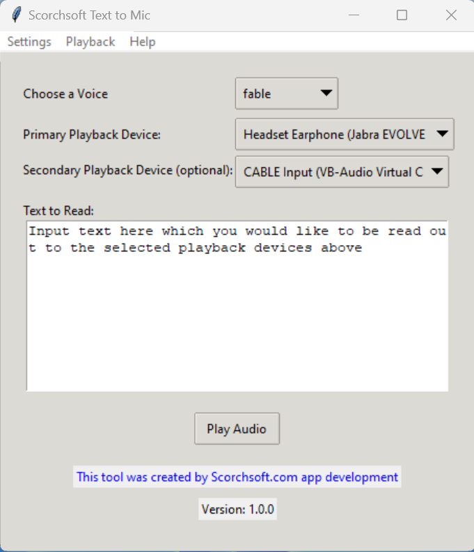

# Readme

This script uses OpenAI to convert text to speech, and then speak that speech over a virtual microphone.

## Running the GUI version

1. Install VB-Cable if you haven't already
https://vb-audio.com/Cable/
This tool creates a virtual microphone on your Windows computer or Mac. Once installed you can then trigger audio to be played on this virual cable.

2. Open the Text to Mic app by Scorchsoft, and input your OpenAPI key. How to set up an API key:
https://platform.openai.com/docs/quickstart/account-setup
(note that this may require you to add your billing details to OpenAI's playground before a key can be generated)

3. Choose a voice that you prefer for the speech synthesis.

4. Select a playback device. I recommend you select one device to be your headphones, and the other the virtuall microphone installed above (Which is usually labelled "Cable Input (VB-Audio))"

3. Enter the text in the provided text area that you want to convert to speech.

4. Click 'Submit' to hear the spoken version of your text.

5. The 'Play Last Audio' button can be used to replay the last generated speech output.

6. You can change the API key at any time under the 'Settings' menu.

This tool was brought to you by Scorchsoft - We build custom apps to your requirements. Please contact us if you have a requirement for a custom app project.

## Running the CLI Version

run the executable or "python text-to-mic.py"

## 1) Install VB-Cable:
https://vb-audio.com/Cable/

## 2) ensure the OpenAI API key is specified in the .env file
This sets up a virtual microphone that we can use to sent text to speech audio to. Then, when you join a meeting, such as a google meeting, you can select this virtual cable to hear the audio being sent on the channel.

## 3) Run the script:
python text-to-mic.py "Text you'd like to speak"

This will then ask you which device you want to send the audio to, and give you a list to choose from. 

Take note of them listed, and record the device ID of your headphones, and of the "Cable Input". For now get it to output to your headphones as a test that it works.

Now that you know your headphone device id, and the cable input id, you can now automatically select both with your command prompt input like this, where 8 and 5 are the respective device indexes:
python text-to-mic.py "Text you'd like to speak" 8 5

# Dependencies

To get this script working you will need to install the following on the relevant operating system

### Windows
* pip install tk
* pip install pyaudio
* pip install python-dotenv
* pip install wave
* pip install pydub

### Mac

* brew install portaudio
* pip install python-dotenv
* pip install wave
* pip install pydub

# Making an installer

## Windows

pip install --upgrade pip  # Ensure pip is updated
pip install pyinstaller   # Install PyInstaller

python -m PyInstaller --onefile --windowed text-to-mic.py

## Mac

brew install python
pip3 install pyinstaller
pyinstaller --onefile --windowed text-to-mic.py
