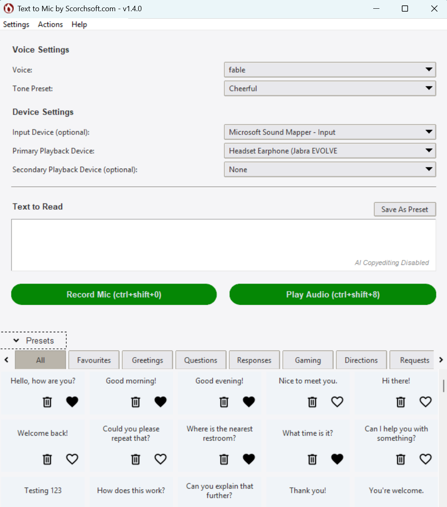

# Readme

## About

**Text to Mic** is a powerful, user-friendly application that seamlessly converts written text into natural-sounding speech, playing it over a virtual microphone. This tool is perfect for situations where you want to automate voice output — whether it's for presentations, online meetings, voiceovers, or accessibility purposes.

More info about Text to Mic including a changelog can be found here:
https://www.scorchsoft.com/blog/text-to-mic-for-meetings/

Developed by Scorchsoft, a leading app development agency, Text to Mic leverages the advanced capabilities of OpenAI's speech synthesis models to produce high-quality audio output. By using a virtual microphone (created with VB-Cable), it allows you to stream generated speech to any application that accepts microphone input, such as Zoom, Google Meet, Microsoft Teams, or any other conferencing tool.

### Key Features:
- **Seamless Text-to-Speech Conversion**: Converts any text into clear, human-like speech with just a few clicks or commands.
- **Virtual Microphone Integration**: Outputs speech directly to a virtual microphone, allowing you to use it in any communication or recording software.
- **Custom Voice Selection**: Choose from various voice profiles to match the tone and style you need.
- **Cross-Platform Compatibility**: Works on both Windows and macOS, with an easy-to-use graphical interface or command line option.
- **OpenAI API Integration**: Utilises the power of OpenAI's state-of-the-art models to ensure the best speech synthesis quality.

Text to Mic is designed to be versatile and efficient, providing users with a reliable tool for dynamic speech generation and broadcasting. Whether you need to narrate text in real time during a virtual event or automate responses in an online environment, Text to Mic has you covered.

This script uses OpenAI to convert text to speech, and then speak that speech over a virtual microphone. Yes this means you need to pay for API call use, and yes there are free TTS tools available. OpenAI has been used due to it's higher TTS accuracy and reduced latency.

This project is licensed under the terms of the [GNU Lesser General Public License (LGPL) v3.0](LICENSE.md) as well as additional terms of use. By using this software, you agree to the terms and conditions outlined in the [LICENSE.md](LICENSE.md) file.

## Screenshots

Manage different speaking tones available:

Customise keyboard shortcuts:

Enable AI Copyediting

## Running the GUI version

1. Install VB-Cable if you haven't already
https://vb-audio.com/Cable/
This tool creates a virtual microphone on your Windows computer or Mac. Once installed you can then trigger audio to be played on this virual cable.

2. Open the Text to Mic app by Scorchsoft, and input your OpenAPI key. How to set up an API key:
https://platform.openai.com/docs/quickstart/account-setup
(note that this may require you to add your billing details to OpenAI's playground before a key can be generated)

3. Choose a voice that you prefer for the speech synthesis.

4. Select a playback device. I recommend you select one device to be your headphones, and the other the virtuall microphone installed above (Which is usually labelled "Cable Input (VB-Audio))"

3. Enter the text in the provided text area that you want to convert to speech.

4. Click 'Submit' to hear the spoken version of your text.

5. The 'Play Last Audio' button can be used to replay the last generated speech output.

6. You can change the API key at any time under the 'Settings' menu.

This tool was brought to you by Scorchsoft - We build custom apps to your requirements. Please contact us if you have a requirement for a custom app project.

## Advanced Tips

### 1. ChatGPT AI Manipulation

If you go to "Settings > ChatGPT Manipulation" then you can turn this on and pick which model to use.

If enabled (both enabled and "auto apply to recorded transcript"), this will run your transcript through AI with the desired prompt each time you record your voice and convert it to text.

If you've enabled but not turned on auto apply, then you can manually trigger this action to any text you've input into "text to Read" via the context menu "Input > Apply AI manipulation to text input". This will only work if you've turned it on and added your API key

### 2. Hotkeys

You can use a hotkey combination to quickly trigger recording and playing of recorded text. By default the hot keys are "ctrl+shift+0" to start the recording, then press it again to stop, transcribe, and submit. "Ctrl+shift+9" stops the recording without playing it. "Ctrl+shift+8" replays the last transcribed or written text.

"Settings > Hotkey Settings" allows you to customise the hotkey combinations used to trigger the above actions.

### 3. Presets 

Click the presets button at the bottom of the app to open the presets area. You can then click a preset to auto add it to the "Text to Read" section, or double click it to immediately play it back.

Once loaded for the first time, presets are stored in "config/presets.json", this means if you close the app you can edit these and add categories etc via notepad. If you do this, please make sure you don't break or invalidate the json structure.

You can also edit presets from within the app, but this is limtied to saving new presets to an existing category, favouriting presets, and deleting them. Any other edits have to be completed by editing the json file.

You can add a new preset by writing it into the "Text to Read" area, then at the top right of the area select the category you wish to add it to, and hit save.

## Running the CLI Version

run the executable or "python text-to-mic.py"

## 1) Install VB-Cable:
https://vb-audio.com/Cable/

## 2) ensure the OpenAI API key is specified in the .env file
This sets up a virtual microphone that we can use to sent text to speech audio to. Then, when you join a meeting, such as a google meeting, you can select this virtual cable to hear the audio being sent on the channel.

## 3) Run the script:
python text-to-mic.py "Text you'd like to speak"

This will then ask you which device you want to send the audio to, and give you a list to choose from. 

Take note of them listed, and record the device ID of your headphones, and of the "Cable Input". For now get it to output to your headphones as a test that it works.

Now that you know your headphone device id, and the cable input id, you can now automatically select both with your command prompt input like this, where 8 and 5 are the respective device indexes:
python text-to-mic.py "Text you'd like to speak" 8 5

# Dependencies

To get this script working you will need to install the following on the relevant operating system

### Windows
`pip install tk pyaudio audioplayer python-dotenv wave pydub keyboard pystray pygame`

### Mac

`brew install portaudio`
`brew install python-tk`
`python3 -m venv ~/code/scorchsoft/text-to-mic-feed`
`source ~/code/scorchsoft/text-to-mic-feed/bin/activate`
`pip3 install python-dotenv`
`pip3 install pyaudio audioplayer`
`pip3 install openai`
`pip3 install wave`
`pip3 install pydub`

# Making an installer

## Windows

pip install --upgrade pip  # Ensure pip is updated
pip install pyinstaller   # Install PyInstaller

OLD:
python -m PyInstaller --onefile --windowed text-to-mic.py

New
python -m PyInstaller --onefile --windowed --add-data "assets;assets" text-to-mic.py

## Mac

brew install python
pip3 install pyinstaller

OLD
pyinstaller --onefile --windowed text-to-mic.py

New
pyinstaller --onefile --add-data "assets:assets" text-to-mic.py
